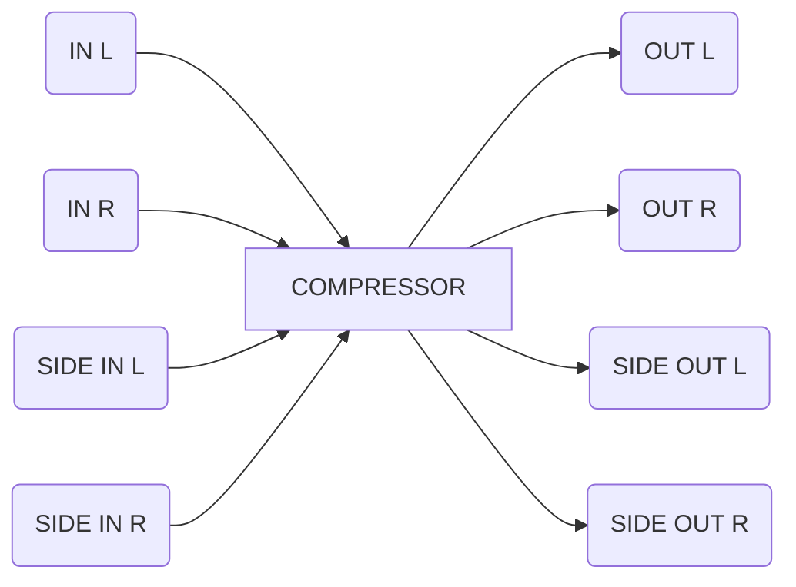

# Erica Synths — Compressor

- [Manual PDF](../../manuals/compressor_manual_2023.04.04.pdf)

---

[Erica Synths Stereo Compressor Manual (PDF)](https://www.ericasynths.lv/media/Compressor_manual_2022.pdf)  
*(Link provided according to typical Erica Synths documentation URLs for further reading)*

---

# Erica Synths Stereo Compressor  
**Eurorack Module Cheat Sheet**

---

## **Overview**

- **Stereo THAT-chip-based compressor** for Eurorack.
- Designed for percussion, live modular mixes, basslines, and sidechain ducking.
- Features **DC-coupled sidechain** and full independent or linked stereo operation.

---

## **Specs**

| Parameter           | Value                   |
|---------------------|------------------------|
| Audio Input Level   | -5V to +5V             |
| Threshold           | -40dB to +10dB         |
| Makeup Gain         | -12dB to +12dB         |
| Ratio               | 1:1 to ∞               |
| Power Consumption   | +60mA / -22mA          |
| Width/Depth         | 10HP / 35mm            |

---

## **Inputs & Outputs**

### **Front Panel Jacks**

- **IN L / IN R**  
  - **Type:** Audio Input (Left/Right)
  - **Range:** -5V to +5V
  - **Use:** Main stereo audio input.

- **OUT L / OUT R**  
  - **Type:** Audio Output (Left/Right)
  - **Range:** Typical eurorack audio levels
  - **Use:** Main stereo output.

- **SIDE IN L / SIDE IN R**  
  - **Type:** CV/Audio Input (Left/Right)
  - **Range:** -5V to +5V
  - **Use:** External sidechain trigger/ducking per channel – patch a drum or kick for beat-based ducking.

- **SIDE OUT L / SIDE OUT R**  
  - **Type:** Buffered Output (Copy of IN L/IN R)
  - **Range:** -5V to +5V
  - **Use:** Pass-through copy of input for splitting or other processing.

---

## **Controls**

- **INPUT LVL** *(Knob)*  
  - Adjusts input level before compression.

- **GAIN** *(Knob)*  
  - Sets compressor’s makeup gain, from -12dB to +12dB.

- **THRESHOLD** *(Knob)*  
  - Sets the level at which compression kicks in (-40dB to +10dB).

- **COMP.AMT (Compression Amount / Ratio)** *(Knob)*  
  - Controls how much compression, from 1:1 (none) to ∞ (limiting).

- **STEREO LINK / PROCESS** *(Toggle Switch)*  
  - **STEREO LINK ON:** Link level detectors for both channels (consistent stereo image).
  - **PROCESS:** Engages compression circuit.

- **BYPASS** *(Button)*  
  - Instant bypass of compression (audition unprocessed sound).

- **8-SEGMENT VU METER**  
  - **Visual:** Shows output level post-compression.

---

## **Panel Reference**

---

## **Operational Tips**

- Use **STEREO LINK ON** for consistent compression and stereo image (great for percussion & full mixes).
- Insert a **sidechain signal** (typically drums/kick) to duck/move melodic content (pump effect).
- If processing very different L/R signals, **stereo linking** avoids wild panning shifts due to channel-independent gain reduction.
- Tweak **THRESHOLD** and **COMP.AMT** for subtle glue or aggressive slap.

---

## **Safety/Usage**
- Never expose to liquids or extreme temps.
- Only ship in original packaging for warranty!

---

## **Links**

- [Erica Synths Official](https://www.ericasynths.lv/)
- [Full Warranty Info](https://www.ericasynths.lv/support/terms-and-conditions/)

---

[Generated With Eurorack Processor](https://github.com/nstarke/eurorack-processor)